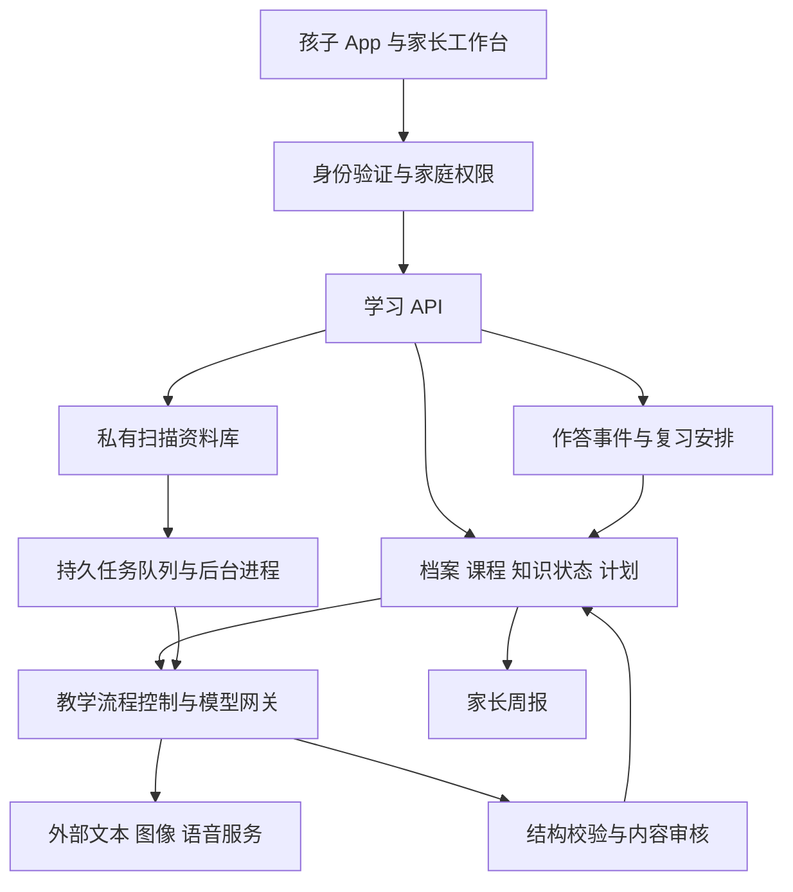

# 家庭 AI 辅助教育产品设计方案

调研与设计日期：2026 年 10 月 1 日。面向大小宝及少数受邀家庭，免费自用。建议继续扩展现有 Family Learning Hub，提供手机和平板使用的学习 App、家长工作台和私有后台服务。

产品的核心承诺是：根据每个孩子的教材进度、真实作答和可用时间，持续决定下一步学什么、怎样讲、怎样练，以及何时确认已经学会。第一阶段以数学为核心验证学科，再逐步扩展英语与其他学科。

本文包含产品设计与开发清单，规划项不等于已实现。用户随后授权两个会话并行开发，首轮客户端实现及联调状态另见 `docs/android-client.md`；尚未变更线上服务。范围按首批 3—5 个家庭、约 5—10 名孩子规划；人数是容量设计假设。依据包括“大小宝名校计划”会话、现有项目文档与代码，以及下列公开来源。

## 竞品选择与调研结论

本次没有找到能统一比较中国中小学、海外课程、语言学习、学习机与 AI 家教教学效果的权威综合榜。网站访问量、应用商店名次、累计用户数、厂商宣传的提分结果，不能作为同一种排名合并。

用于筛选候选的可核验信息如下：

- 多邻国 2026 年第二季度披露平均日活跃用户 5,870 万，说明其使用规模；这个数字不等于 AI 功能用户数，也不证明教学效果优于其他产品。[多邻国季度股东信](https://www.sec.gov/Archives/edgar/data/1562088/000162828026053299/q2fy26duolingo6-30x26share.htm)
- 本次读取的中国区 iPhone 教育免费榜页面快照中，多邻国第 2、作业帮第 4；页面没有给出统一统计日期，且搜索摘要与打开页面的名次存在差异，因此只用来识别候选，不把它表述为 10 月 1 日实时排名。[Apple 教育榜](https://apps.apple.com/cn/iphone/charts/6017?chart=top-free&l=en-GB)
- Similarweb 当前可读取的全球教育网站榜统计月份为 2026 年 8 月，前五是 Scribd、Instructure、PW、Udemy、Clever。其分类包含文档、课程和学校基础平台，与本项目的家庭 AI 辅导目标并不完全一致。[Similarweb 教育网站榜](https://www.similarweb.com/top-websites/science-and-education/education/)
- ALEKS 官网自报累计服务超过 5,000 万学生，作为成熟自适应学习系统纳入研究；累计服务人数不能与月活或日活比较。[ALEKS 官网](https://www.aleks.com/index)

下表按对本项目的参考价值排列，不是市场份额或教学质量排名。功能来自官方介绍或开发者商店说明；本次没有注册并逐一用相同试题实测，不能据此给出准确率优劣结论。

| 产品及来源 | 公开资料中的主要能力 | 本项目建议借鉴 | 适配时的重点 |
| --- | --- | --- | --- |
| [Khanmigo](https://khanmigo.ai/) | 结合 Khan Academy 内容，通过提问引导学生思考，提供家长和教师工具 | 分级提示、围绕已审核内容讲题、家长参与 | 自建中国教材与学校进度映射；不能直接套用海外课程 |
| [IXL](https://www.ixl.com/materials/diagnostic/IXL_Diagnostic_Action_Plan_Guide.pdf) | 诊断具体技能，形成个人行动计划，指出下一步练什么 | 知识点掌握状态、下一步推荐及推荐理由 | 先覆盖实际在学章节；缺少证据时显示待诊断 |
| [ALEKS](https://www.aleks.com/index) | 根据知识状态与前置知识缺口持续调整学习路径 | 从当前错题回溯前置知识，再安排学习 | 小样本阶段采用清晰可解释的规则，后续再评估复杂算法 |
| [讯飞 AI 学习机](https://edu.iflytek.com/solution/family/learning-pad) | 官网介绍 AI 精准学、错题与学情分析；具体功能因产品版本而异 | 本地课程对齐、错因诊断、家长可读的学习报告 | 软件先落地，沿用家庭现有手机、平板和纸笔 |
| [豆包爱学](https://apps.apple.com/cn/app/id6469102455) | 开发者介绍 AI 老师、拍题答疑、作业批改、错题整理、写作辅导 | 低门槛拍照入口、自然追问、易懂的解释 | 将每次互动结果沉淀为可复核的学习记录 |
| [作业帮](https://apps.apple.com/cn/app/id803781859) | 商店公开介绍 AI 搜索、拍题答疑与作业批改 | 扫描归档与家庭作业资料整理 | 原图、孩子答案、参考答案分开保存；搜到答案之后继续安排验证 |
| [松鼠 Ai](https://squirrelai.com/) | 官网介绍诊断驱动的学习路径、针对性练习、持续测评与家长查看 | 测评、教学、练习、再测评的完整流程 | 官网涉及不同地区及学习中心产品，不能推定全部功能适用于本地家庭版 |
| [Quizlet](https://quizlet.com/features/ai-study-tools) | 官方可检索内容介绍资料生成练习测验、学习指南和记忆卡片 | 把孩子自己的资料转成复习卡与小测 | 词汇、事实性知识适合卡片；数学证明需要步骤与迁移验证。直接访问部分页面受限 |
| [Duolingo](https://blog.duolingo.com/video-call/) | 短时学习任务及 AI 对话练习 | 清晰的每日起点、短任务、口语情境练习 | 奖励有效练习与进步；日任务可跳过、可减量 |
| [Speak](https://www.speak.com/) | AI 口语对话、即时发音与表达反馈、按错误安排个性化复习 | 英语开口练习、重复错误追踪 | 与孩子课本词汇和听说目标连接；先验证识别儿童语音的可靠性 |
| [Photomath](https://photomath.com/) | 扫描数学题，展示分步解法，有时提供多种方法 | 清晰的数学排版、逐步讲解、方法比较 | 讲解后安排独立变式题，验证能否自己完成 |

推荐优先研究 Khanmigo 的辅导方式、IXL 与 ALEKS 的诊断方式、讯飞的课程适配、豆包爱学的交互入口。口语和资料生成能力放到第二阶段。

学习效果需要独立测量。2025 年一项高中数学研究发现，AI 辅助练习表现与撤去 AI 后的考试表现可以出现不同方向的变化，教学约束会影响结果。因此本项目把无提示复测设为必需环节；这项研究并不证明某款商业产品的效果，也不能直接推算本家庭会提高多少分。[PNAS 论文](https://doi.org/10.1073/pnas.2422633122)

## 现有项目可以继承什么

现有 README 与代码已包含账号、私有扫描归档、模型识题接口、学习记录同步、错题、2／7／30 天复习及家长复盘的实现。本次是静态阅读，没有重新测试这些功能或验证当前线上运行状态。

需要优先处理的结构变化很明确：`lib/family-state.ts` 把孩子固定为 `xiaobao` 与 `dabao`；`server/family-store.ts` 主要按账号存储整份家庭学习状态。面向其他家庭时，应引入真正的家庭、成员、孩子、课程和作答实体。

已存在的扫描与讲解能力可继续利用。当前文档明确 PDF 主要用于归档及手工整理，因此自动拆页、逐题识别和完整的互动讲题仍要单独开发与验收。

## 每个孩子的个性化档案

首版采用家庭账号登录，一个家庭下可创建多个学生档案，登录后选择或切换当前学生，无需为每个学生反复登录。学生数量不固定为两个；大小宝只是首个家庭中的两个学生。

每名学生仍有独立的档案、知识记录、学习计划和辅导上下文。家长可修正档案，系统保存来源与变更时间。页面持续显示当前学生的昵称或头像，拍照前清楚显示资料归属。

当前学生按设备分别记忆，手机上的切换不会改变另一台平板正在使用的学生。每次上传、作答和辅导任务在创建时绑定学生 ID；切换学生后，正在处理的任务仍归原学生，未完成的练习保存到原学生的草稿，不将内容带入新学生的对话。

| 信息 | 最少需要保存 | 如何影响教学 |
| --- | --- | --- |
| 学习阶段 | 年级、学期、地区、教材版本、当前章节、预计毕业年份 | 限定内容、符号表达和解题方法范围 |
| 当前目标 | 本周学校进度、近期考试范围、长期方向 | 安排本周主攻内容 |
| 知识证据 | 作答原文、对错、是否提示、提示层级、题目版本、日期 | 更新对应知识点，保留判断依据 |
| 学习过程 | 错在什么步骤、用过什么解释、哪种解释之后能独立完成 | 调整讲法和下一道题 |
| 时间与偏好 | 家庭约定的可用时间、纸笔或屏幕偏好、兴趣主题 | 控制任务量、选择例子与互动形式 |
| 复习进度 | 最近独立通过日期、变式表现、下次复测时间 | 生成到期复习任务 |

学校全称、精确生日、住址不是首版必填项。兴趣用于选择解释情境；不把一次表现推断成智力、性格或固定的“学习类型”。疲劳或情绪仅记录孩子、家长主动表达的情况，不通过摄像头作判断。

原项目将大宝描述为高二、小宝描述为初一，同时保留了待确认的毕业年份。首次使用必须核对实际学籍、教材目录及选科，年级与毕业年份出现冲突时由家长确认。

## 个性化学习怎样运转

流程为：建档与基线 → 诊断薄弱知识 → 生成短计划 → 独立尝试 → 分步辅导 → 独立变式 → 隔时复测 → 更新下一周计划。

首次建档先读取近期作业、试卷与学校进度，再补少量诊断题。首轮建议每个主攻学科 10—15 分钟，可分次完成。短诊断仅覆盖已测的技能，不输出“全科已掌握百分之几”。

每个知识点采用五种可解释状态：待诊断、需要支持、提示后完成、独立完成、隔时迁移通过。另存证据数量、最近测评时间和不确定项。不能把模型自己报告的置信度当作可靠掌握概率。

建议采用以下初始规则，并用试用结果调整：

1. 同一知识点在不同题目中独立完成，才允许从“提示后完成”升级；抄过讲解的原题不算新的独立证据。
2. 复测沿用现有 2／7／30 天起点。答错或依赖提示时提前安排补练；稳定完成后逐步延长。间隔是产品默认规则，不宣称对每个孩子都最优。
3. 优先处理到期复习、阻碍当前课程的前置缺口与近期考试重点；候选任务必须满足知识前置关系、可用时间与内容已审核三个条件。
4. 每周只选 1—2 个主攻知识主题。每日卡片说明推荐理由，例如“上次需提示，今天用一道新题检查能否独立完成”。
5. 家长可调整优先级，孩子可选择今天的任务顺序、申请更简单的例子或结束学习。

AI 辅导采用“询问已做到哪里 → 一个提示 → 孩子作答 → 针对当前步骤反馈”的节奏。连续受阻时提供简短示范，再换一道题让孩子独立完成。完整答案可以查看，但会计为受助学习；验证环节不提供提示。

初期课程结构用“课程—章节—知识点—前置关系—题目”即可。公共课程知识与每个孩子的私有作答分开存储。规划规则决定教学目标、任务量及掌握状态，语言模型负责解释、提问与生成候选内容，写入结果前经过服务端校验。

## 大小宝的两种学习模式

下表是按原项目阶段设计的使用示例，不是对两个孩子能力的诊断。真实任务由学校进度和作答决定。

| 项目 | 大宝模式 | 小宝模式 |
| --- | --- | --- |
| 目标 | 围绕实际高中课程、选科和考试失分，补前置知识并练迁移 | 建立概念、表达与订正习惯，跟上实际初中课程 |
| 首批学科 | 数学优先；物理、化学、生物按真实选科与资料逐步接入 | 数学优先；英语词汇和课内表达随后加入 |
| 学习方式 | 上传周练，定位出错步骤，比较解法，纸笔完成新题 | 每次一个小目标，图示或生活例子，口头讲清，再独立作答 |
| 暂定时长 | 一次 20—30 分钟，可用纸笔承担主要练习 | 一次 10—20 分钟，按家庭负担调整 |
| AI 的关键动作 | 确认是建模、知识、计算还是表达问题，再补相应环节 | 先让孩子表达已有理解，避免把会跟读当作会做 |
| 周报重点 | 独立解题、迁移题表现、反复失分环节 | 概念解释、独立完成、复习节奏和主动提问 |

例如小宝在“负数比较”题目中两次答错，系统先用数轴补概念，再给不同数字的新题；第二天正确后仍保留复测。大宝在函数题上计算错误，系统先验证代数变形是否稳定，再决定是否重讲函数。两人即使使用同一模型，也会收到不同内容与不同下一步任务。

阅读表达、体育、劳动和兴趣探索可先作为家长配置的线下任务。升学目标作为长期参考坐标，政策数据附来源、适用地区与年份，更新经确认后生效；不依据少量记录预测录取概率。

## App 与家长工作台

用户已确认首批设备以安卓手机和安卓平板为主，孩子端优先制作安卓 APK 试用版，家长保留网页工作台，共用同一后台。手机侧重点是拍照和短时答疑，平板侧重点是题目与讲解并排显示、练习和复习。技术上优先评估复用现有 React 界面并通过 Capacitor 接入原生能力；服务端代码与模型密钥留在服务器。网页入口继续提供兼容访问。推送、离线和录音逐机验证；离线仅保留已下载任务及待同步答案，AI 讲解需要联网。

首版主流程为：家庭账号登录 → 选择或切换学生 → 选择数学 → 拍一张可含多题和手写过程的照片 → 自动框题与归属校对 → 选择题目并校对手写步骤 → 分步辅导 → 独立变式题 → 保存到该学生的学习记录 → 家长按学生查看结果。

| 使用者 | 页面 | 主要操作 |
| --- | --- | --- |
| 家庭成员 | 学生选择与切换 | 登录后选择当前学生，显示昵称或头像，在本家庭内切换 |
| 孩子 | 今日学习 | 最多三个推荐任务、预计时间、推荐原因，直接开始 |
| 孩子 | 我的老师 | 围绕当前任务打字、拍照或后续语音提问；选择“给提示”“换个例子”“我来讲” |
| 孩子 | 复习与练习 | 到期复测、纸笔练习、独立变式，完成后看到具体反馈 |
| 孩子 | 我的进步 | 查看已掌握技能、自己的作品和下一小步 |
| 家长 | 家庭总览 | 切换孩子，了解本周进展与需要帮助的地方 |
| 家长 | 档案与计划 | 配置教材、目标、时长，查看和调整 AI 建议 |
| 家长 | 资料库 | 上传、整理、校对题目，选择是否收为错题 |
| 家长 | 每周复盘 | 查看证据支持的变化、未解决问题与下周建议 |
| 家长 | 账号与数据 | 管理家庭账号、监护成员、设备、学生档案、导出和删除 |

平板讲题页将题目、图形或纸笔照片与当前一步提示并排展示；手机使用上下排列。公式可缩放，题目原图随时可查，答案按步骤展开。只在任务完成后出现明确的结束页，鼓励回到线下活动。

周报示例应写成：“负数比较的两道新题独立完成，七天复测尚未进行；应用题仍需要提示。下周建议保持三次短练习。”每句话可点开对应证据，不能只输出泛泛的鼓励或没有依据的能力标签。

## 资料进入教学系统的流程

1. 在当前学生下选择学科，拍照或导入资料，补充来源；原件先私有保存。任务创建时绑定家庭与学生，上传中切换学生不会改变原任务归属。首版支持单张照片中的多道题，包括一页上的若干题目；多页整卷的跨页自动拼接和 PDF 批处理随后扩展。
2. 检查清晰度、缺边、方向和透视，生成预处理副本；保留原图及副本间的坐标映射。
3. 自动检测题目边界、题号、题干、选项、图表和作答区，在图片上显示编号框，允许调整、拆分、合并和补框。
4. 逐题识别印刷内容与手写内容，区分孩子作答、批注和参考答案，建立题目与作答区域的关联；归属不明时请用户选择。
5. 显示原图与逐行转写，保留公式、可见涂改和待确认符号。孩子或家长可核对转写与区域归属；低可信或结构复杂内容进入家长审核。
6. 分开保存可见作答证据、AI 诊断假设、参考解法和建议训练。只有题目条件、作答转写和用于训练的答案完成相应核验，才更新掌握状态或发布变式题。
7. 生成少量对应变式，保留原题关联和生成版本；数学尽可能通过计算或符号工具复核，无法验证的题目进入人工审核。
8. 孩子练习与复测结果进入独立事件记录，重新计算知识状态和计划。

孩子原答案与模型参考答案不得互相覆盖。试卷中的文字只作为资料输入，不具有修改系统规则、调用工具或访问其他文件的权限。

每个家庭的原件和学习记录私有。公共题库只放自有或获得授权的内容，AI 变式也要检查正确性及来源，不把“改了数字”视为自动取得共享许可。家庭共享练习需要家长主动选择，并在共享前检查是否残留个人信息或受限内容。

## 多题框选与题目归档

一张照片是原始资料容器，每道题是独立学习记录。原图不覆盖；框线作为可编辑标注叠加显示，同时按已确认区域生成单题裁剪图。每道题保存稳定 ID、原题号、页码、区域坐标、图文内容、作答区域和原件关联。框线调整会生成新的标注版本，裁剪图可由原图重新生成。

界面显示“检测到若干题，哪些内容待确认”，点选某个框后进入该题卡片。提供拖动边框、增加遗漏题目、拆开误合并题、合并被拆开的同一道题、重新归属手写步骤等操作。候选题目数量只是系统检测结果，确认页面仍应允许检查整张照片中的遗漏。

| 情况 | 处理规则 |
| --- | --- |
| 一页多题、左右分栏 | 按题号、版面和语义联合划分，保存阅读顺序，不以横向等分或简单段落分隔代替切题 |
| 一道大题含多个小问 | 保存大题与小问关系，共用题干和图示；小问可以独立练习，但保留共同条件 |
| 一题有多个不相连的区域 | 同一题关联多个矩形或多边形区域，例如左侧题干、右侧配图与下方作答 |
| 手写写到边缘或其他题旁边 | 结合题号、位置和内容给出候选归属，归属不明时标记待确认 |
| 下一张照片继续同一道题 | 首期支持手动关联补充照片；后续再评估自动跨页拼接 |
| 原图歪斜或经过透视校正 | 坐标必须标明所属图片版本，保存变换关系，确保缩放、旋转后框线仍对齐 |
| 条件或图形被拍照截断 | 提示补拍并关联原题，在内容补全前暂缓判分、知识诊断和变式生成 |

先确定题目边界和内容完整性，再分类学科、题型、教材章节与知识点。知识点标签属于可修正的分析结果；共享图形、复杂推理或条件不足时允许保持待确认。

切题候选可由专用教育 OCR 或版面检测产生，再由多模态模型协助检查内容关系。阿里云官方结构化切题接口提供题目切分、文字与坐标输出，可纳入样本评估；通用版面块并不天然等于完整题目。[阿里云精细版结构化切题](https://help.aliyun.com/zh/ocr/developer-reference/api-ocr-api-2021-07-07-recognizeedupaperstructed)

## 手写过程复现与证据分析

支持提取纸面上可见的手写文字、数字、公式及草稿，按照版面顺序和数学关系组织为可核对的步骤。手写图形、辅助线和箭头保留图片区域及必要描述，不强行转成一段纯文本。学生书写与老师批注若无法可靠区分，应标记作者不明，由用户确认，不能只按墨水颜色判断。

每条步骤保存所属题目、原图区域、逐字转写、可选公式表示、版面顺序、可见涂改、识别器质量信息和校对版本。针对负号、指数、分数线、不等号、单位等关键符号单独突出不确定处。识别器的质量分只作为校对提示，不能直接作为答案正确率或孩子掌握度。

提供原笔迹视图、转写视图和分析视图。点选文字能高亮对应笔迹，点选原图能定位转写；分析视图逐步说明有效步骤、首次出现的问题、后续受影响的步骤，以及缺少哪些证据。更正转写或区域归属后，依赖旧版本的诊断标记为过期并重算，保留修改记录。

照片只能支持纸面内容复现。无法从一张静态照片可靠恢复真实下笔时间顺序、先后尝试或已经擦除遮盖的字迹；版面顺序与推测的解题关系应区别显示。未来若需要真实书写回放，需要在平板书写时记录笔画和时间戳。

大模型同时接收已确认题干、必要的整页上下文、单题裁剪图、原手写区域与校对后的转写。先逐步分析学生已有作答，再单独生成参考解法，不把参考解法补写成学生原本的推理，也不因与标准解法不同就判错。

诊断输出至少区分三类信息：

- 可观察事实：定位到具体题目与步骤，例如“第 2 行展开括号时，常数项未乘以括号外的系数”。
- 待验证原因：可能是知识理解、方法选择、计算或书写执行问题，需要更多证据，不能直接认定为粗心、懒惰或能力差。
- 下一步验证：询问这一步的理由，或安排少量针对性新题；根据独立作答结果决定补概念还是练执行与检查。

合成示例：题目 `2(x+3)=10`，孩子写成 `2x+3=10`，随后写 `x=3.5`。系统可以指出首次可见错误在展开括号，但不能仅凭这一次就判断是分配律未掌握还是漏乘。先让孩子说明展开规则，再给一道相近结构的新题，补充证据后调整训练。

习惯分析只基于重复、可定位的行为，如多次未写要求的单位、等式连接不规范或必要步骤缺失。报告列出观察的题数、发生次数和样例；没有写验算过程不等于没有在心里检查。家长和孩子可以纠正诊断，系统不据此推断智力、性格或注意力障碍。

手写数学公式已有可用识别方案，例如 PaddleOCR 公式识别支持手写公式输出为 LaTeX。具体对大小宝字迹的准确程度，必须通过授权样本验证。[PaddleOCR 公式识别文档](https://github.com/PaddlePaddle/PaddleOCR/blob/main/docs/version3.x/pipeline_usage/formula_recognition.en.md)

## 后台服务与数据结构

建议继续使用项目已有的 React、TypeScript 与 Node 服务体系。首期使用模块化单体加一个独立后台任务进程；异步任务处理识题、PDF 拆页、变式草稿及周报，避免长请求占满网页服务。

首期 SQLite 继续承担结构化存储，启用适合并发读取的配置并控制写入事务；图片、PDF 放在私有文件目录。课程检索先按知识点 ID、章节和全文索引实现。家庭数量、写入竞争或部署实例增加时再评估 PostgreSQL、对象存储与更独立的队列，不在首期同时引入过多基础设施。

| 模块 | 主要实体 | 必需规则 |
| --- | --- | --- |
| 账号与家庭 | families、memberships、children、devices、invites | 邀请加入、监护关系、角色权限、会话撤销 |
| 课程与题目 | curricula、skills、skill_edges、questions、question_versions | 教材版本、前置知识、出处、答案版本、审核状态 |
| 私有资料 | assets、pages、regions、question_regions、extracted_questions | 家庭与学生、文件校验值、原图与变换、题目层级、多区域关联、标注版本、访问鉴权 |
| 学习证据 | attempts、answer_steps、transcription_revisions、diagnostic_findings、hint_events、mastery_evidence | 步骤原图定位、作者归属、转写与校对版本、事实与诊断假设、是否独立、提示层级、证据时间 |
| 计划与复习 | plans、tasks、review_schedules | 规则版本、推荐理由、家长调整、到期时间 |
| 教学互动 | tutor_sessions、session_summaries | 只加载当前孩子的必要上下文，限制历史长度 |
| 运行管理 | jobs、model_runs、audit_events | 重试、失败状态、耗时、用量、错误反馈与审计 |

旧账号迁移时创建对应家庭，将原 `dabao`、`xiaobao` 映射到新的孩子 ID，并建立旧 ID 对照。迁移先在备份副本验证记录数量、题目关联与附件访问，再切换；保持回退能力。客户端通过带唯一事件 ID 的增量同步提交作答，服务端处理版本冲突，避免整份 JSON 相互覆盖。

每个访问入口都由服务端依据家庭账号或获授权的家庭成员推导可访问家庭，再校验目标学生归属，包括文件下载、任务查询、导出及历史对话。家庭登录模式允许切换本家庭的学生；当前学习页面、统计和 AI 上下文只加载所选学生的数据，禁止跨家庭访问。后台必须从已创建任务读取学生归属，不能在异步结果返回时使用界面当前选择的学生。管理员默认查看运行元数据，查看家庭原件须获得该家庭授权并留记录。

工程沿用现有工程目录方案：服务器总目录为 `/home/ubuntu/codex_project/workspace_own/family-learning-hub/`，源码放 `code/`，运行版本放 `runtime/`，数据放 `data/`，配置放 `config/`，备份放 `backups/`，图片处理与 PDF 拆页暂存放 `temp/`。具体线上位置执行前重读当前工程文档与服务配置。

## 模型接入与管理员后台

继续利用已有模型接口，通过一个网关区分识题、讲解、候选出题、周报和后续语音。逻辑上的分工不要求每一步调用不同模型，也不需要首期构建多智能体系统。

截至本次调研，DeepSeek 官方 Vision 文档已列出 `deepseek-flash` 图片输入及支持格式。因此可以优先用现有供应商验证识题；上线模型名和参数必须按实际账号能力测试，不能把协议兼容等同于全部媒体能力一致。PDF 可拆成页面图片处理，录音则通过独立语音识别与合成能力接入。[DeepSeek Vision 文档](https://api-docs.deepseek.com/guides/vision/)

管理员后台需要六个工作区：家庭与邀请、课程与题目审核、扫描任务与失败重试、学习质量反馈、模型与用量、备份与恢复状态。当前最有价值的操作是修改识别错误、撤回错误题目、查看一次教学引用的证据，以及暂停异常模型调用。

模型版本或提示模板更新前，用同一批已审核样题回归评估。答案校验不能只依靠同一个模型再次说“正确”；选择题和数值题使用确定性判分，开放题结合评分依据与人工复核。存在歧义时不直接给孩子扣分或降低掌握状态。

## 隐私与费用控制

受邀家庭由监护人开通，清楚说明原件和对话是否会送到模型供应商处理，并提供学习数据导出、账号撤销及删除入口。发送给模型前尽量遮盖姓名、学校和联系方式，仅发送教学必需的题目区域与当前上下文。供应商的数据保留与训练用途需要依据其实际服务设置核实，不能仅凭某个请求参数承诺“不留存”。

原件、密钥与备份都不进入 Git 或公共静态目录。每日备份包含数据库和附件，并做一致性校验；同机备份用于误操作恢复，另留一份加密异地副本以应对服务器故障。导出和删除都遵守家庭隔离，备份中的删除记录按约定保留周期清除。

现有服务器记录为 4 核、约 4 GB 内存，适合作为小规模外部模型 API 方案的试运行起点；可用资源需部署前重查，不能据此承诺并发容量。首期建议后台重任务从 1 个并发开始，以实际内存、延迟与队列积压决定扩容。

免费使用仍有服务器、模型、存储和备份费用。后台按家庭、孩子、功能统计实际调用与费用，分别限制每日识题页数、对话量及批量生成量。可将全站每月 AI 费用 300 元作为可调整的初始预算上限，在 80% 时提醒，在预算用尽后暂停额外 AI 生成；这是建议的控制阈值，不是当前供应商报价或保证够用的成本预测。已有任务、资料和纸笔练习继续可用。

先采集一周真实调用数据，再按“每页识题成本、每次完整辅导成本、每个活跃孩子周成本”估算月支出。缓存已确认的题目解析，限制重复识别，对长对话进行必要摘要，避免每日重新发送全部历史。

## 开发顺序与验收

下列周期是原有范围的开发粗估，包含集成和基本验证，不是交付承诺。本轮增加单图多题切分和手写过程结构化，需先完成样本验证，再重估对应阶段周期。真实试用和内容审校需要家庭参与，不能用开发速度替代。

| 阶段 | 建议周期 | 交付内容 | 通过条件 |
| --- | --- | --- | --- |
| 第一阶段 | 约 1—2 周 | 家庭登录与多学生切换、权限、邀请、档案、旧数据迁移、资料校对、后台任务 | 两个测试家庭互相无法访问；切换学生后资料、对话和统计正确切换；在途任务与草稿不串学生；迁移和恢复可验证 |
| 第二阶段 | 原估约 2—3 周，新增识别范围后待重估 | 单图多题框选、手写步骤转写与校对、数学选定章节诊断、今日计划、逐步讲题、独立变式、复习 | 漏题和误合并可发现并校正；题干、配图和手写归属可核对；诊断定位到步骤；完成从错题到隔时复测全流程 |
| 第三阶段 | 连续试用 4 周 | 大小宝先试，再逐个邀请少数家庭；周报、反馈、内容修正和费用观测 | 任务负担可接受；数据完整；错误能纠正；能够比较独立复测变化 |
| 第四阶段 | 依据试用决定 | 英语词汇与短口语、更多理科内容、进一步优化手机和平板体验 | 新学科具备已审核内容及相应评分方式；预算与家长投入可持续 |

首期内容建议限定为每个孩子正在学习的 1—2 个数学章节，每个关键知识点配置诊断题、例题、独立练习和复测变式。通过这一小块验证流程，再逐章扩充；其他学科可先用于资料归档和家长辅助讲解。

建议保留 50—100 道经过人工确认的评测样题，覆盖常规题、带图题、手写答案、模糊照片、缺条件及题面包含恶意指令等情况。单独评估题目提取、答案正确性、提示泄露和不确定性处理，不合成一个掩盖缺陷的总分。新生成而未通过审核的题不进入自动教学。

多题与手写能力先用约 20—30 张经授权并去除无关个人信息的照片做初步评估，包含双栏、多小问、共享图形、横跨题区的草稿、可见涂改和潦草公式。预先标注题目与手写的正确归属，留出未用于调试的验证照片。分别统计漏题、误合并、条件或图示遗漏、手写串题、关键符号识别、步骤转写与首次错误定位，以及人工校对耗时；框线重叠率不能代替内容完整性验证。不把厂商公布的总体准确率作为本产品的验收结果。

发布前重点验证账号越权、多学生切换、多设备各自选择学生、在途任务和草稿归属、重复同步、上传中断、识题重试、错误答案撤回、到期复测、预算限制及备份恢复。性能通过真实设备和预期并发测试确定。

试用每周看六项指标：

- 七天后在新题上的无提示通过率，按孩子和知识点分别记录；
- 三十天保持情况，并区分重复原题与迁移题；
- 提示依赖是否下降，任务难度是否相当；
- 孩子完成有效任务的用时和家长整理资料的用时；
- 人工确认的错误讲解、错误判分及纠正速度；
- 每个活跃孩子的实际模型成本与家庭愿意继续使用的程度。

首周建立基线，之后使用相近难度但不同题目的独立复测。少数家庭试用只能用于发现问题和判断实用性，不能据此宣传普遍提分效果。

首批开发最关键的交付场景是：家庭账号登录后选择一名学生，选择数学并拍一张包含多道题与手写过程的照片，系统框出各题并关联孩子作答；用户能调整框线、确认归属和校对手写，选择一道题完成步骤分析、一次分步辅导和一道独立变式题。后台将原图、题目区域、作答证据和学习结果保存到该学生档案，家长网页能按学生查看。随后切换到另一名学生，独立完成同样流程，确认题目、教学上下文和学习结果不混用。这条流程稳定后，再扩展多页整卷自动拼接、PDF 批处理、多科目和更深入的思维训练。

## 已确认首版的开发清单

2026 年 10 月 1 日，用户确认家庭内多学生切换、单张照片多题框选及手写过程复现进入首版范围。下列内容为开发拆解，仍属于设计文档，不表示相关功能已实现。读取“大小宝名校计划”最新状态，该会话的工程目录整理已完成；后续实施先比对服务器 `code/` 的提交和工作区状态，以其实际源码为基准，避免用本机恢复副本覆盖较新的工作。

### 页面与主要操作

| 页面 | 首版内容 | 完成后的去向 |
| --- | --- | --- |
| 学生首页 | 家庭登录、学生头像与昵称、添加或切换学生、数学入口、待完成资料 | 进入当前学生的拍照或历史记录 |
| 拍照与上传 | 拍照或相册导入、预览重拍、清晰度提示、当前学生与科目、上传进度 | 原件保存成功后显示后台处理进度；失败保留本机草稿 |
| 分题校对 | 原图编号框、题目列表、缩放、补框、拖动、拆分、合并、关联配图与作答 | 保存整张照片的题目结构，选择一题继续 |
| 作答校对 | 题干与笔迹对照、逐步转写、公式显示、涂改与批注、不确定符号、步骤归属 | 确认选中题目的条件和作答；其他题可暂存待核对 |
| 分步辅导 | 先展示孩子原有步骤，定位问题，按需给提示和追问，再做一道独立变式 | 保存独立作答与提示使用情况，安排后续复习 |
| 家长工作台 | 按学生查看原图、题目、孩子步骤、诊断依据、变式结果、待核对内容 | 纠正识别或诊断，调整学习安排 |

手机使用单栏和视图切换；平板、家长网页使用原图与步骤并排显示。当前学生在拍照、校对和辅导页面保持可见。家长可协助录入和校对，系统区分“原纸面作答”和“辅导后的新作答”；校对文字不计为孩子完成新练习。

首版无需把一页所有题目一次学完。整页资料可以先归档，只有准备辅导的题目需要完成相应校对；其余题保持待处理状态。允许保留没有作答的题目，不能把空白识别成答错或知识点不会。

### 后台处理与版本规则

1. **创建资料任务**：服务端校验学生属于当前家庭，生成稳定资料 ID，固定学生归属；文件保存成功才进入识别队列。客户端重试使用同一请求标识，避免重复归档。
2. **处理图片**：检查质量，生成方向或透视校正副本，保留原图、尺寸、变换关系和原件校验值。框坐标统一关联明确的图片版本，不使用显示屏像素作为存储坐标。
3. **生成候选题目**：识别题目区域和题目层级，再提取印刷内容、手写步骤及作者候选；每题和每步有独立 ID，增删或重新编号不改变其他题的身份。
4. **保存待核对结果**：资料任务完成不等于识别内容正确。每题分别记录题面完整性、作答归属、转写确认状态；有歧义的题不阻塞同页其他已核对题的学习。
5. **启动分析与辅导**：绑定选中题目及已确认的标注、转写版本，只加载该学生的必要学习上下文。无法解释的步骤标记待澄清，不能用参考解法替换原始作答。
6. **记录学习证据**：原作答、辅导互动、独立变式分别保存。诊断引用具体步骤；纠正框线、题干或手写转写后，将受影响的诊断和统计标记待重算。

队列至少区分排队、处理中、待核对、失败和取消；题目另外区分待补图、待转写确认、可辅导和分析待更新。进程重启后恢复未完成任务，重试需有次数上限，保留可读的失败原因。工作进程领取任务时使用租约或等效机制，结果写入时检查资料和版本仍有效，防止重复执行覆盖人工修改或重新写回已删除资料。

### 实施顺序与现有接入点

| 顺序 | 工作包 | 可检查的交付物 |
| --- | --- | --- |
| 1 | 动态学生档案与旧数据兼容 | 一个家庭可新增第三名学生；大小宝原记录仍可访问；多设备选择互不影响 |
| 2 | 原图、区域与步骤的数据结构，分题及转写校对界面 | 用合成照片即可手动框选、关联题目、录入步骤、保存和重开，先确认数据关系与交互可用 |
| 3 | 持久后台任务与识别服务适配 | 统一输出区域、题目层级、手写步骤及不确定项；用授权样本比较识别效果、校对耗时和成本后确定服务组合 |
| 4 | 基于步骤证据的诊断、辅导与变式 | 定位到原笔迹；能解释诊断依据；确认后的独立练习结果进入学生档案 |
| 5 | Android APK 与家长网页联调 | 真实手机和平板拍照、授权拒绝后重试、上传中断恢复、后台任务恢复、版本升级及家长查看均可验证 |

Android 相机、登录会话与上传在第 2 个工作包期间做最小真机验证，避免最后才发现客户端接入限制；第 5 个工作包负责完整安装包与流程验收。

本机静态代码中的接入点包括：`lib/family-state.ts` 固定 `xiaobao`、`dabao` 的类型及同步逻辑；`lib/scans.ts` 的题目和扫描记录结构；`app/components/scan-workspace.tsx` 的录入与核对界面；`server/scans-backend.ts` 的上传、识别及确认流程；`server/model-gateway.ts` 的模型输出。现有 `learnerAnswer` 是字符串，不能直接承担可定位、可修订的逐步证据。家庭扫描主界面调用 `/api/family/scans`；仓库同时存在 `/api/scans` 路由，实现前梳理实际启用入口与兼容需求，不能只改其中一个就宣称所有入口支持动态学生。

### 首版验收用例

| 场景 | 必须观察到的结果 |
| --- | --- |
| 同家庭三个学生，两个设备同时使用 | 每个设备保持自己的当前学生；任务和学习结果进入创建时选定的学生 |
| 一个学生上传期间切换到另一个学生 | 原任务和草稿归属不变；新学生看不到旧学生的辅导上下文 |
| 另一家庭尝试访问资料、任务或图片 ID | 服务端拒绝访问，不能仅依靠页面隐藏 |
| 双栏多题，含公共题干、图形和多个小问 | 题目可分别打开且条件完整；错误切分能补框、拆分、合并并保存 |
| 一道题的手写答案跨越多个区域 | 所有步骤能归属该题；相邻题的答案不被自动当成已确认作答 |
| 出现负号、指数、分数线、涂改及教师批注 | 原图可对照；不确定内容可修正；作者不明的内容不直接计入学生表现 |
| 照片缺少条件，或孩子尚未作答 | 可补拍或保持空白；不输出确定判分，不降低掌握状态 |
| 校对后修改关键符号或答案归属 | 原修订保留；受影响的诊断、变式和学习统计更新或进入待重算状态 |
| 上传重试、工作进程重启、人工修改与旧任务结果冲突 | 不重复建档、不覆盖新版本；界面能恢复进度并说明失败原因 |
| 完成辅导和一道独立变式 | 家长能追溯原题、原步骤、所用提示和独立结果；辅导中答对不冒充独立掌握 |
| Android 安装及升级 | 手机和平板能完成全流程；升级保留资料和账号状态；模型密钥不进入 APK |

以上是功能验收条件。识别质量另按前文样本方案出报告，分别列自动结果与人工校对后的结果，记录未解决样例；真实样本验证尚未完成，当前不承诺自动切题或手写识别的准确率。
